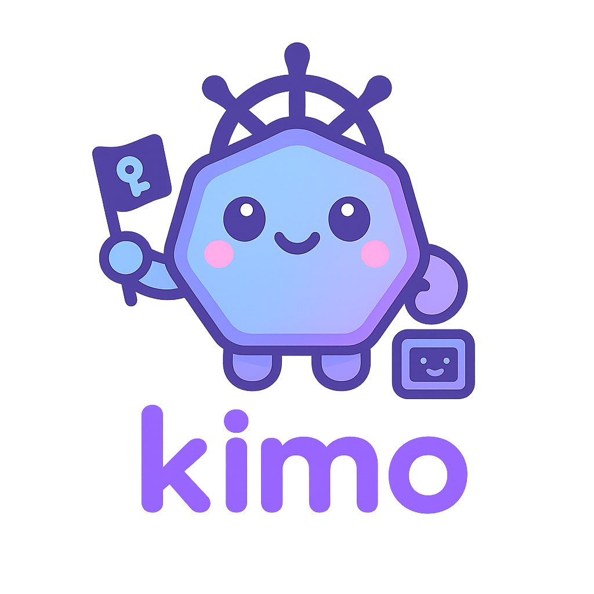

<p align="center">
  
</p>

<p align="center">
  <em>Kubernetes Instance Manager Operator for CTF challenges</em>
</p>

---

KIMO is a Kubernetes operator that provisions CTF challenges as containers, on demand, with a TTL-driven lifecycle, per-instance network isolation, PoW-based abuse prevention, and a pluggable backend layer for integrating with any scoring platform (a generic HMAC-webhook adapter out of the box, plus a CTFd adapter as a worked example).

See `docs/kimo-design.md` for the architecture, `docs/kimo-roadmap.md` for current project status, and `docs/kimo-impl.md` for the implementation plan.

## Installation

Prerequisites: a Kubernetes cluster, `kubectl`, and Helm 3.

```bash
git clone https://github.com/kimo-ctf/kimo.git
cd kimo
helm install kimo helm/kimo/
```

This installs the CRDs and deploys the operator with the default `generic` scoring backend. To point it at a different backend instead:

```bash
helm install kimo helm/kimo/ -f config/samples/values-ctfd-backend.yaml
```

Backend selection and config live under `integration.backend` / `integration.config` in `helm/kimo/values.yaml`.

## Quick start

Apply a sample challenge and watch it come up:

```bash
kubectl apply -f config/samples/web-sqli-template.yaml
kubectl get challengeinstance
```

The instance's `status.phase` moves through `Pending -> Creating -> Running` as its Pod passes its readiness check.

## Development

No local toolchain required — `hack/dev.sh` runs Go/kubebuilder/Helm commands in a container, and `hack/kind.sh` runs a local kind cluster the same way. A VS Code devcontainer is also available under `.devcontainer/`.

```bash
hack/dev.sh go build ./...
hack/dev.sh go test ./...
```

## Status

Core CRDs, controllers, the REST API, PoW, and the Helm chart are implemented and tested (unit tests plus a real envtest integration suite). The Discord bot is not currently in the tree — see `docs/kimo-roadmap.md` for details.
